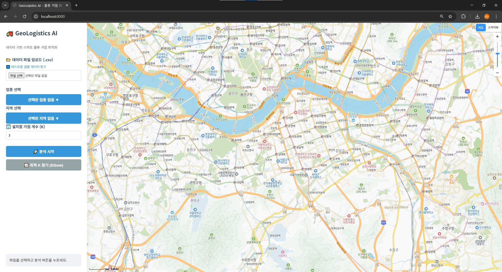
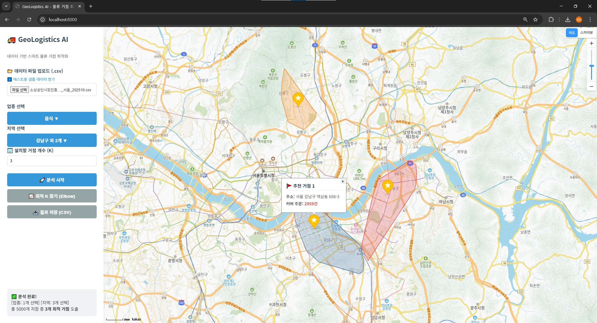
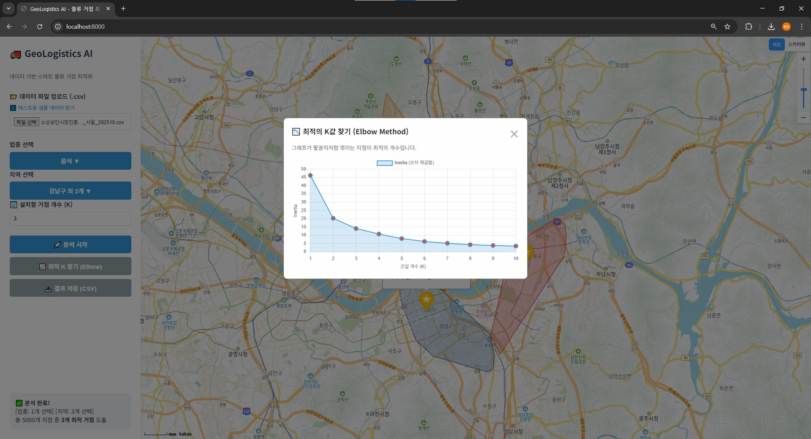
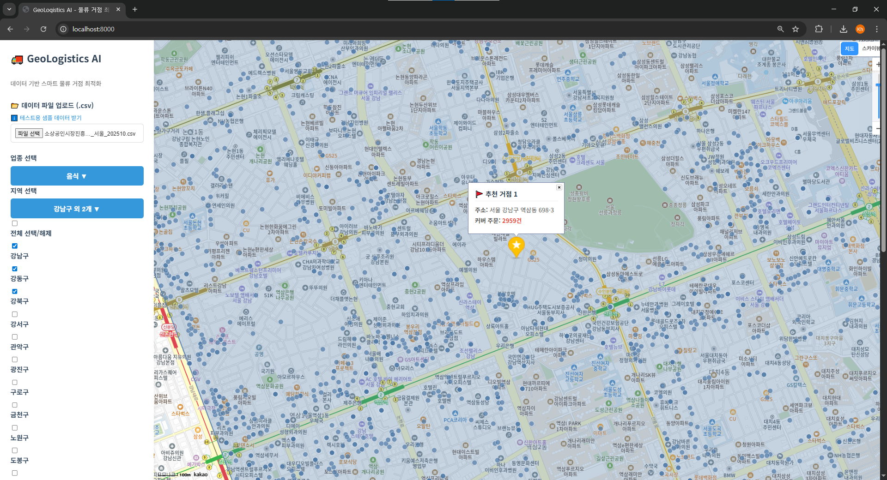
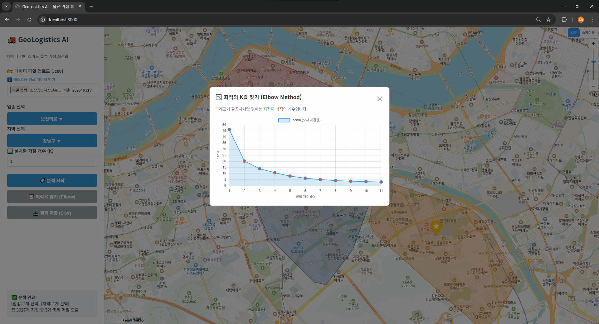

# 🚚 GeoLogistics AI - 물류 거점 최적화 서비스


**GeoLogistics AI**는 공공데이터 및 고객 주문 데이터(위도/경도)를 기반으로 **머신러닝(K-Means Clustering)** 알고리즘을 활용하여, 최적의 **물류 거점(Hub) 위치를 추천**해주는 웹 서비스입니다.

복잡한 코딩 없이 CSV 파일 업로드만으로 데이터를 시각화하고, 최적의 입지 조건을 과학적으로 분석할 수 있습니다.

---

## 📸 시연 영상 및 스크린샷 (Demo & Screenshots)

### 🎥 시연 영상 (Demo Video)
https://github.com/user-attachments/assets/e5837fe9-a2cb-4c0f-ab7b-76739ed98b29


> *GeoLogistics AI 시연 영상: 데이터 업로드부터 최적 거점 도출까지의 과정*

### 🖥️ 주요 기능 화면

| **1. 메인 화면 & 파일 업로드** | **2. K-Means 분석 결과 (지도)** |
|:---:|:---:|
|  |  |
| *공공데이터 CSV 업로드 및 로딩 UI* | *클러스터링 영역 및 추천 거점 시각화* |

| **3. 최적 K값 탐색 (Elbow)** | **4. 다중 필터링 & 결과 저장** |
|:---:|:---:|
|  |  |
| *Elbow Method 그래프 시각화* | *업종/지역 필터링 및 CSV 다운로드* |

---

## ✨ 주요 기능 (Key Features)

### 1. 📊 데이터 시각화 & 분석
* **CSV 파일 업로드:** 공공데이터포털 등의 상권 정보나 주문 내역 CSV 파일을 업로드하면 자동으로 전처리합니다.
* **지도 시각화:** Kakao Maps API를 연동하여 마커 및 클러스터 영역(Polygon)을 지도 위에 직관적으로 표시합니다.
* **K-Means 알고리즘:** 머신러닝 기법을 활용하여 데이터 분포에 따른 최적의 거점 좌표를 도출합니다.

### 2. 🔍 고급 필터링 시스템
* **다중 선택(Multi-select) 필터링:** 업종(Category) 및 지역(Region) 기반의 다중 선택 기능을 지원합니다.
* **사용자 친화적 UI:** 체크박스 드롭다운 UI를 통해 원하는 조건(예: '음식, 숙박' + '강남구' + '서초구')을 손쉽게 설정할 수 있습니다.

### 3. 📈 최적 K값 탐색 (Elbow Method)
* **Elbow Method 분석:** 데이터에 가장 적합한 거점 개수(K)를 모를 때, 이를 추천해주는 그래프 시각화 기능을 제공합니다. (Chart.js 활용)

### 4. 💾 결과 저장 및 공공데이터 활용
* **CSV 다운로드:** 분석된 결과(거점 위치, 배정된 클러스터 ID 등)를 브라우저에서 즉시 다운로드하여 엑셀 등에서 활용할 수 있습니다.
* **공공데이터 최적화:** 소상공인시장진흥공단 상권정보 등 다양한 위치 기반 공공데이터를 분석하는 데 최적화되어 있습니다.

### 5. ⚡ 향상된 사용자 경험 (UX)
* **로딩 오버레이:** 대용량 데이터 처리 시 진행 상황을 알 수 있는 직관적인 로딩 스피너를 제공합니다.
* **반응형 디자인:** 깔끔한 사이드바와 버튼 레이아웃으로 사용 편의성을 높였습니다.

---

## 🛠 기술 스택 (Tech Stack)

| 구분 | 기술 스택 | 설명 |
| :--- | :--- | :--- |
| **Backend** |  | 핵심 로직 및 데이터 처리 (v3.12) |
| |  | 고성능 비동기 웹 프레임워크 |
| |  | 대용량 데이터 전처리 및 필터링 |
| |  | K-Means 군집화 알고리즘 구현 |
| **Frontend** |  | 시맨틱 마크업 구조 |
| |  | 커스텀 스타일링 및 레이아웃 |
| |  | 비동기 통신(Fetch API) 및 DOM 조작 |
| | **Kakao Maps SDK** | 지도 시각화 및 주소 변환(Geocoding) |
| **DevOps** |  | 컨테이너 기반의 배포 환경 구성 |

---

## 🚀 설치 및 실행 방법 (Installation)

이 프로젝트는 Docker 환경에서 가장 빠르고 간편하게 실행할 수 있습니다.

### 1. 프로젝트 복제 (Clone)
```bash
git clone [https://github.com/chakihwan/GeoLogistics-AI.git](https://github.com/chakihwan/GeoLogistics-AI.git)
cd GeoLogistics-AI
```
### 2. 환경 변수 설정(.env)

Kakao 지도 API 사용을 위해 루트 경로에 .env 파일을 생성해야 합니다. (Kakao Developers에서 JavaScript 키 발급 필요)

```bash
# .env 파일 생성 후 아래 내용 입력
KAKAO_JS_KEY=여기에_발급받은_카카오_자바스크립트_키_입력
```

### 3. Docker로 실행 (권장)

```bash
# 컨테이너 빌드 및 실행
docker-compose up --build
```
실행 후 브라우저 주소창에 http://localhost:8000 입력하여 접속.

### 4. 로컬 환경에서 실행 (수동)
Docker가 없는 경우 아래 명령어로 실행합니다.
```bash
# 가상환경 생성 (선택사항)
python -m venv venv
# Windows: venv\Scripts\activate
# Mac/Linux: source venv/bin/activate

# 의존성 설치
pip install -r requirements.txt

# 서버 실행
uvicorn app.main:app --reload
```

## 📂 프로젝트 구조 (Directory Structure)
```
GeoLogistics-AI/
├── app/
│   ├── data/            # 데이터 저장소 (옵션)
│   ├── static/          # 정적 리소스
│   │   ├── script.js    # 프론트엔드 로직 (API 호출, 지도 제어)
│   │   ├── style.css    # 스타일 시트
│   │   └── sample_data.csv # 테스트용 샘플 데이터
│   ├── index.html       # 메인 UI 페이지
│   ├── main.py          # FastAPI 메인 서버 및 API 엔드포인트
│   └── services.py      # K-Means 및 Elbow 분석 핵심 로직
├── Dockerfile           # 도커 이미지 빌드 설정
├── docker-compose.yml   # 도커 컨테이너 오케스트레이션 설정
├── requirements.txt     # 파이썬 의존성 패키지 목록
└── data_gen.py          # 테스트용 더미 데이터 생성 스크립트
```

## 📝 데이터 형식 (CSV Format)
분석을 위해 업로드하는 CSV 파일은 최소한 다음 컬럼을 포함해야 합니다. 
(공공데이터포털의 표준 데이터 형식을 지원하며, 컬럼명은 한글/영문 모두 자동 인식합니다.)
```
id	lat (위도)	lon (경도)	category (선택)	region (선택)
1	37.498095	127.027610	음식	강남구
2	37.511963	127.000714	숙박	서초구
```
### Tip: 공공데이터포털(data.go.kr)의 '소상공인시장진흥공단_상가(상권)정보' 데이터를 다운로드 받아 업로드하면 즉시 분석해볼 수 있습니다.

## 👨‍💻 Author
Chakihwan - Initial work & Full Stack Development - GitHub Profile

---

## 💡 분석 결과 해석 가이드 (Business Insight)

본 서비스의 핵심 기능인 **Elbow Method** 분석 결과를 비즈니스 의사결정에 활용하는 방법입니다. 데이터 분석 결과(Inertia 그래프)를 기반으로 다음과 같은 전략적 시나리오를 도출할 수 있습니다.

> **예시: 강남구 상권 데이터 분석 시**





**1. 💰 비용 절감 최우선 시나리오 (K=2)**
* **해석:** 그래프의 기울기가 가장 급격하게 감소하는 구간입니다.
* **전략:** 초기 투자 비용과 운영비를 최소화해야 하는 스타트업이나 소규모 운영 단계에 적합합니다. 최소한의 거점(2개)으로 가장 큰 효율 개선을 기대할 수 있는 **'가성비 최적화'** 단계입니다.

**2. ⚖️ 서비스 품질 균형 시나리오 (K=3) [권장]**
* **해석:** 그래프가 꺾이는 **'Elbow Point'** 지점입니다.
* **전략:** 비용이 다소 증가하더라도 배송 거리를 단축하여 고객 만족도를 높여야 할 때 적합합니다. **소비자의 편의성(빠른 배송)과 기업의 운영 효율성 사이에서 최적의 타협점**을 찾은 상태입니다.

**3. 📉 고비용 저효율 구간 (K ≥ 4)**
* **해석:** 거점을 추가해도 거리 단축 효과가 미미해지는 '수확 체감' 구간입니다.
* **전략:** 특별한 사유(특정 지역의 폭발적 주문량 등)가 없다면, 거점을 무리하게 늘리는 것은 투자 대비 효율이 낮으므로 권장하지 않습니다.

---

## 🔧 문제 해결 및 트러블슈팅 (Troubleshooting Log)

프로젝트 개발 과정에서 발생한 주요 이슈와 해결 과정입니다.

### 1. Backend: 데이터 타입 및 변수명 불일치
* **문제:** `NameError: name 'List' is not defined` 오류 발생 및 CSV 다운로드 시 클러스터 ID가 `undefined`로 저장되는 현상.
* **해결:**
    * `main.py`에 `typing` 모듈의 `List`를 명시적으로 임포트하여 의존성 문제 해결.
    * 백엔드(`services.py`)의 DataFrame 키 값(`cluster`)과 프론트엔드(`script.js`)의 참조 변수명(`row.cluster`)을 통일하여 데이터 정합성 확보.

### 2. Frontend: 대용량 데이터 처리와 UI 프리징
* **문제:** 대용량 CSV 파일 업로드 및 분석 시 서버 연산 시간 동안 화면이 멈춘 것처럼 보여 사용자 경험(UX) 저하.
* **해결:**
    * 전체 화면을 덮는 **로딩 오버레이(Spinner)**를 구현하여 진행 상태를 시각적으로 피드백.
    * `Async/Await` 패턴을 적용하여 비동기적으로 요청을 처리하고, `finally` 블록에서 로딩창이 확실히 닫히도록 예외 처리 강화.

### 3. UI/UX: 다중 선택 필터링 사용성 개선
* **문제:** 기본 `<select multiple>` 태그는 `Ctrl` 키를 눌러야 하는 불편함이 있어 직관적이지 않음.
* **해결:** **커스텀 체크박스 드롭다운 UI**를 직접 구현하여 클릭만으로 다중 선택이 가능하도록 개선하고, '전체 선택/해제' 기능과 동적 라벨링("음식 외 2건")을 추가하여 편의성 증대.

### 4. DevOps: 정적 리소스 경로 및 캐싱 이슈
* **문제:** 배포 시 CSS 스타일이 적용되지 않거나 `script.js` 404 오류 발생.
* **해결:**
    * FastAPI의 `StaticFiles` 마운트 경로와 HTML 내 리소스 참조 경로를 일치시켜 404 오류 해결.
    * 브라우저 캐싱 문제로 CSS가 갱신되지 않는 현상은 HTML 내 충돌하는 Tailwind 유틸리티 클래스를 제거하고 CSS 우선순위를 재조정하여 해결.

---

## 배운점
본 프로젝트를 수행하며 단순한 기능 구현을 넘어, 실제 사용자 관점에서의 서비스 설계와 데이터 분석 기술의 실무 적용 능력을 함양할 수 있었습니다.

* **1. 데이터 분석 역량 강화**

  머신러닝 알고리즘의 실무 적용: 이론으로만 접했던 K-Means 군집화와 Elbow Method를 실제 지리 데이터(위도/경도)에 적용해 보며, 데이터의 특성에 따른 군집화 과정과 최적의 의사결정 모델을 도출하는 전 과정을 경험했습니다.

  데이터 전처리 중요성 체감: 공공데이터 및 CSV 파일의 다양한 인코딩(UTF-8, CP949)과 결측치 처리를 구현하며, 분석의 정확도를 높이기 위한 데이터 전처리의 중요성을 깊이 이해했습니다.

* **2. 풀스택 개발 및 문제 해결 능력 향상**

  비동기 통신 및 UI/UX 개선: 대용량 데이터 처리 시 발생할 수 있는 사용자 대기 시간을 고려하여 비동기 처리(Async/Await)와 로딩 피드백(Overlay) 시스템을 구현함으로써, 사용자 경험(UX)을 크게 개선했습니다.

  프론트엔드-백엔드 연동: Python(FastAPI) 백엔드와 Vanilla JS 프론트엔드 간의 데이터 흐름(FormData 전송, JSON 응답 처리)을 직접 설계하고 구현하며 웹 서비스의 전체적인 아키텍처를 파악했습니다.

* **3. 소프트웨어 배포 및 운영 지식 습득**

  Docker 컨테이너 활용: 개발 환경과 배포 환경의 일치성을 보장하기 위해 Docker 및 Docker Compose를 도입하여, 애플리케이션의 이식성과 유지보수 편의성을 확보했습니다.

  디버깅 및 최적화: 지도 API 연동 시 발생하는 좌표계 문제나 대용량 CSV 처리 시의 메모리 이슈 등 다양한 기술적 난관을 해결하며 실무적인 디버깅 능력을 키웠습니다.

* **4. 공공데이터 활용 가치 발견**

  사회적 가치 창출 가능성 확인: 누구나 접근 가능한 공공데이터를 활용하여 물류 비용 절감이라는 실제 비즈니스 문제를 해결할 수 있는 가능성을 확인했으며, 데이터 기반 의사결정 시스템의 효용성을 입증했습니다.
